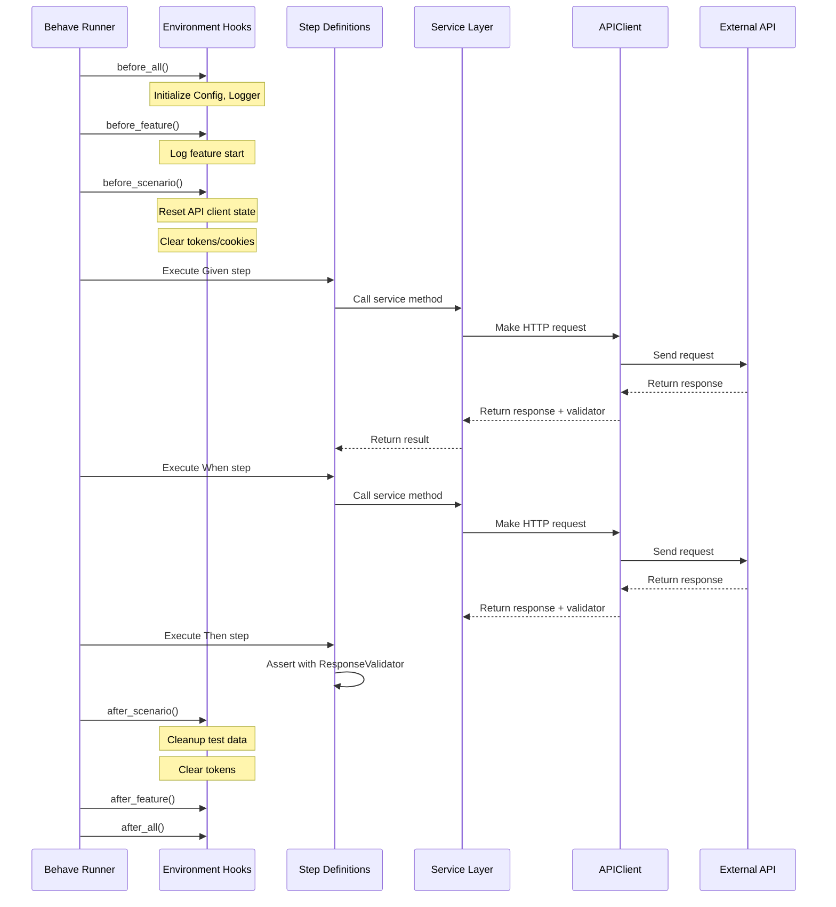
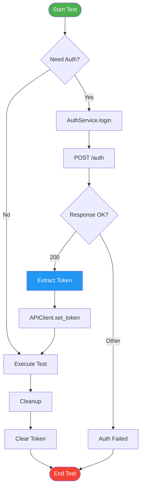
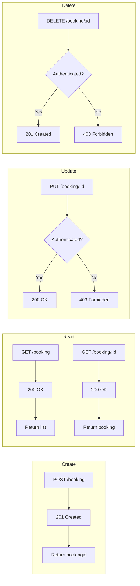
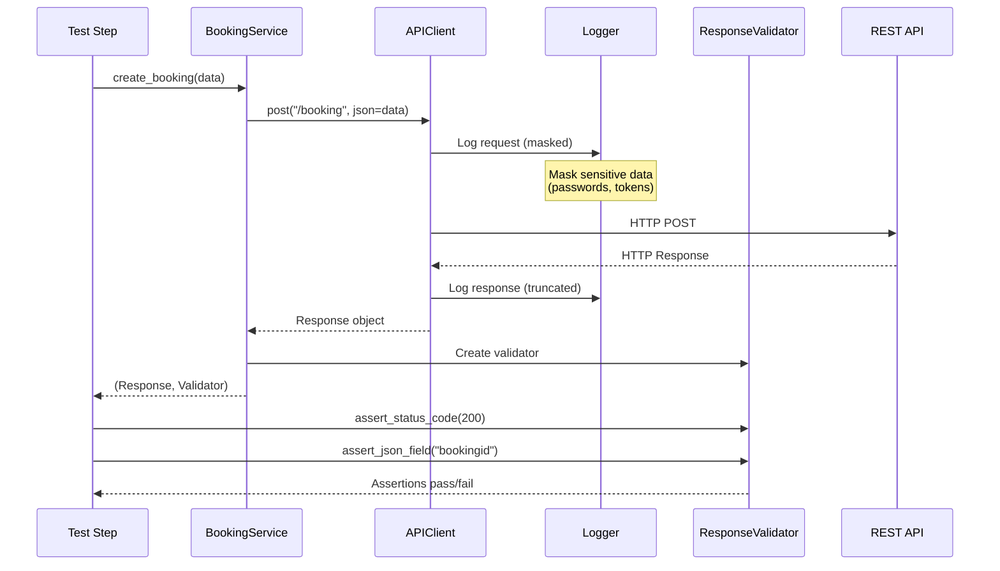
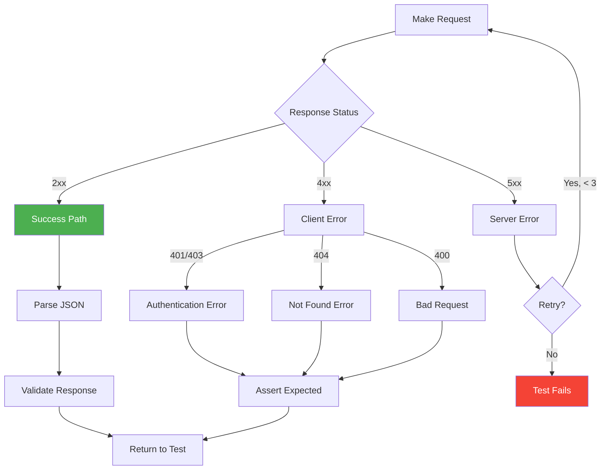
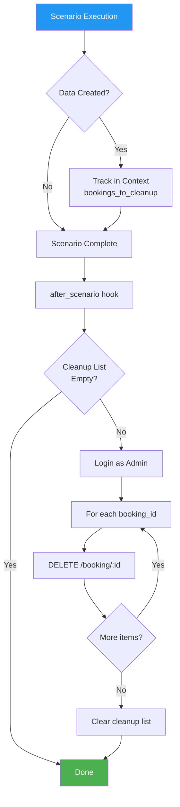
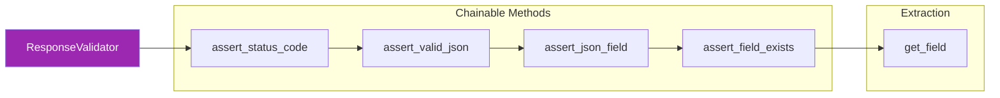
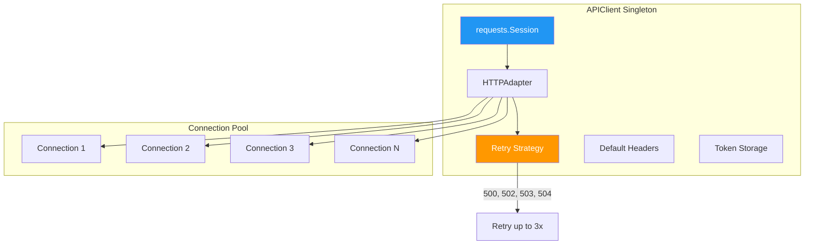

# API Testing Flow

This document visualizes the API test execution flow and request/response lifecycle.

## API Test Execution Flow

## Authentication Flow

## Booking CRUD Operations

## Request/Response Lifecycle

## API Error Handling

## Test Data Cleanup Flow

## Response Validator Chain

## API Client Connection Pooling

