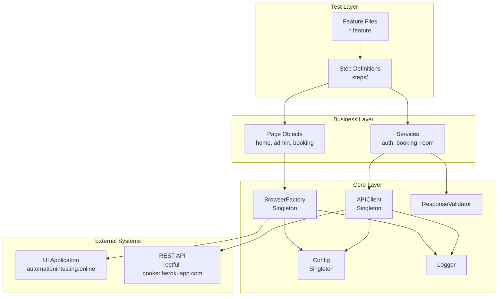
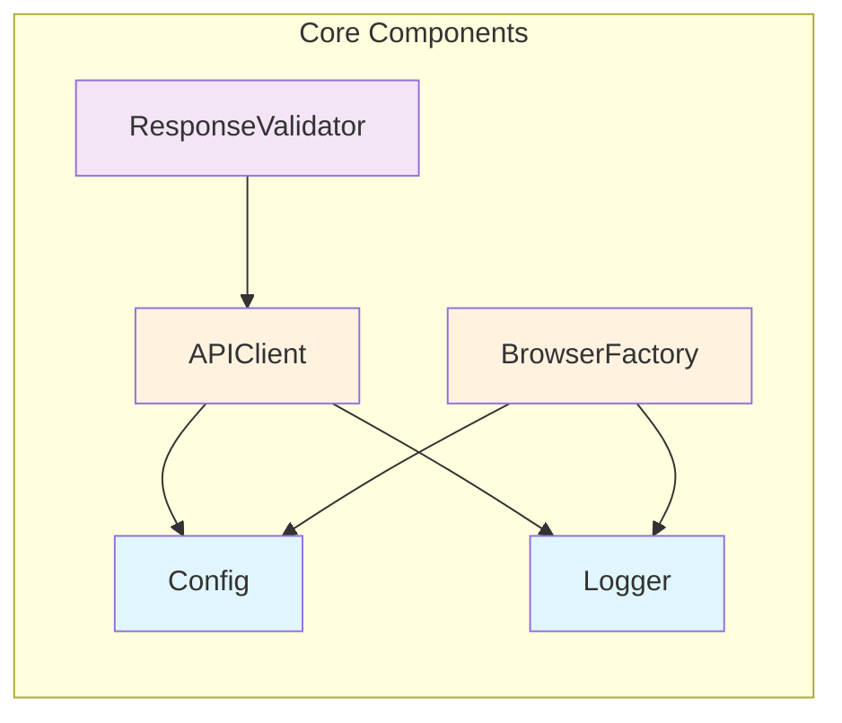
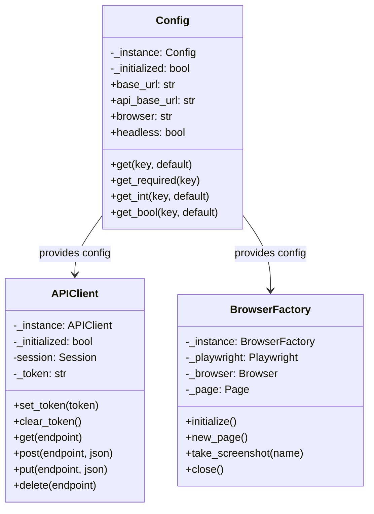
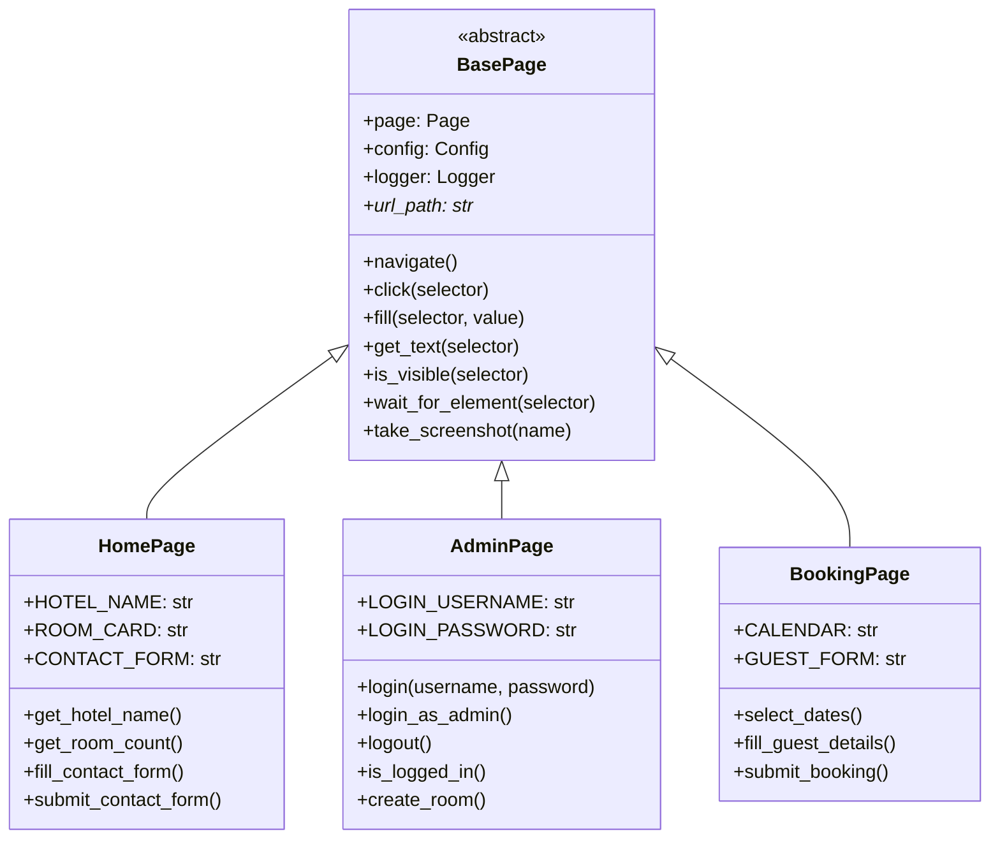
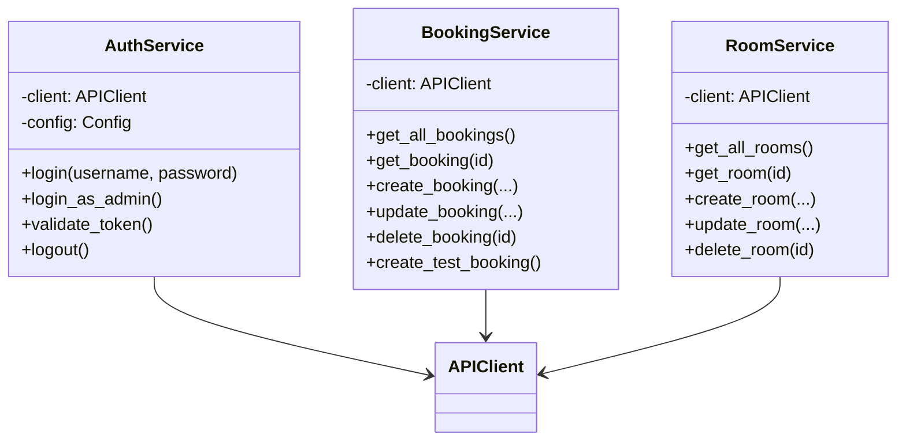
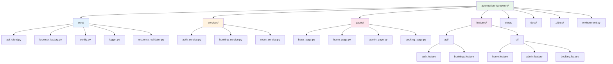
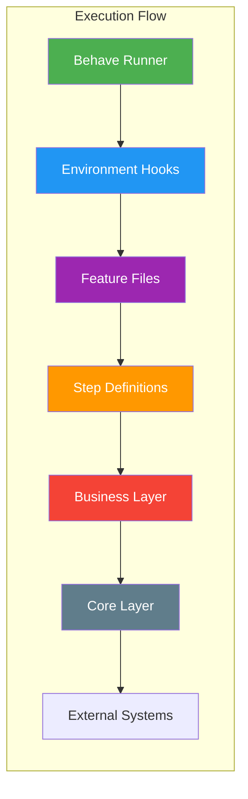

# Framework Architecture

This document provides a visual overview of the test automation framework architecture using Mermaid diagrams.

## High-Level Architecture

## Component Dependencies

## Singleton Pattern Implementation

## Page Object Model Structure

## Service Layer Architecture

## Directory Structure

## Test Execution Layers

