# UI Testing Flow

This document visualizes the UI test execution flow, browser lifecycle, and page object interactions.

## UI Test Execution Flow

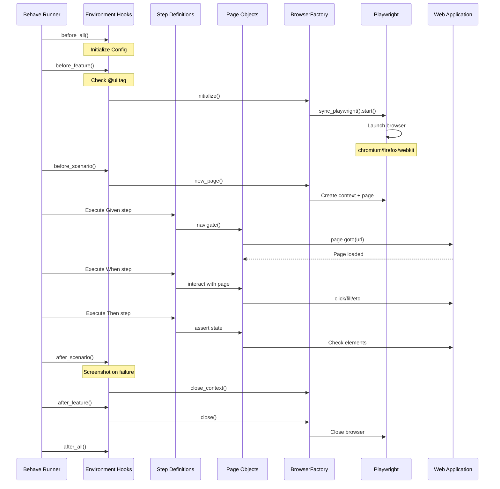

## Browser Lifecycle Management

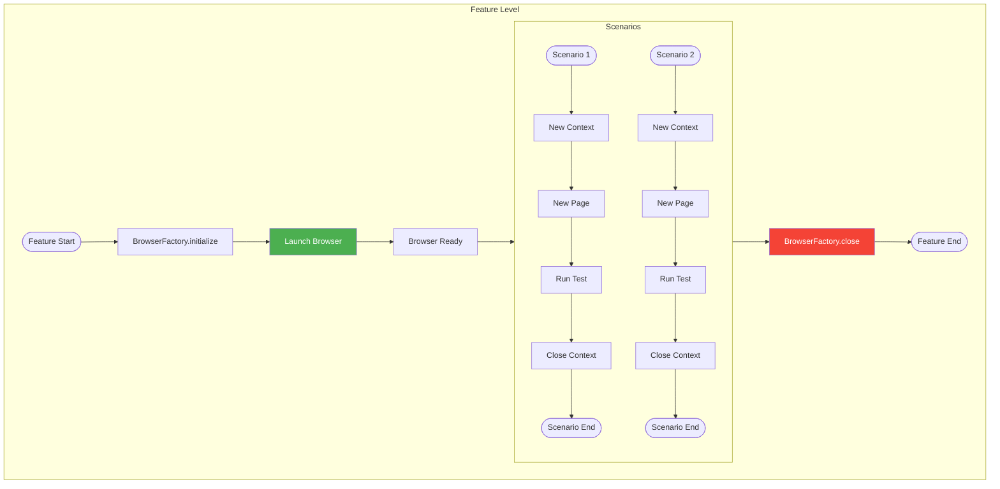

## Page Object Model Flow

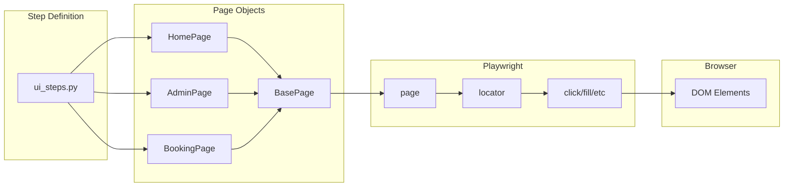

## Page Navigation Flow

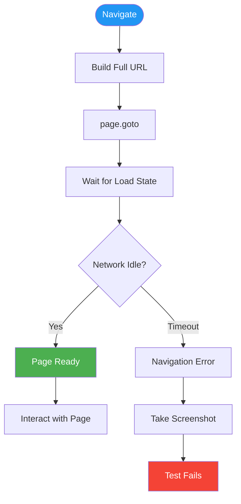

## Element Interaction Pattern

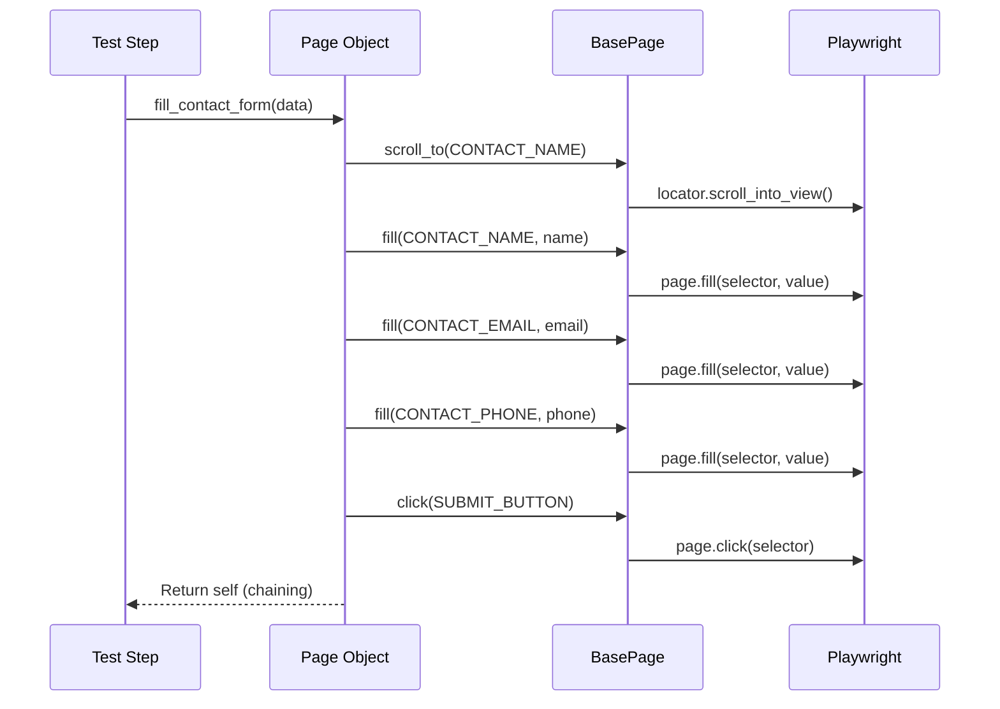

## Screenshot on Failure Flow

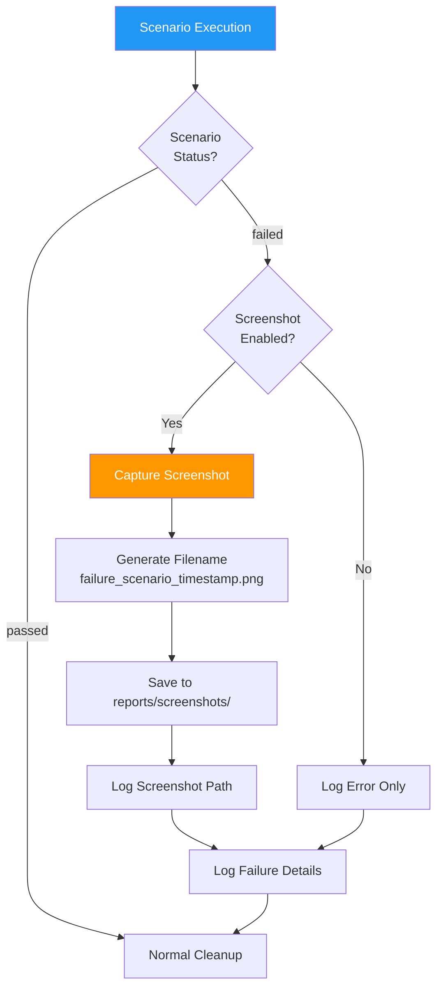

## Home Page Test Flow

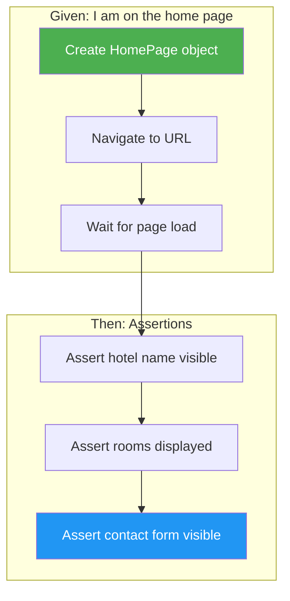

## Contact Form Submission Flow

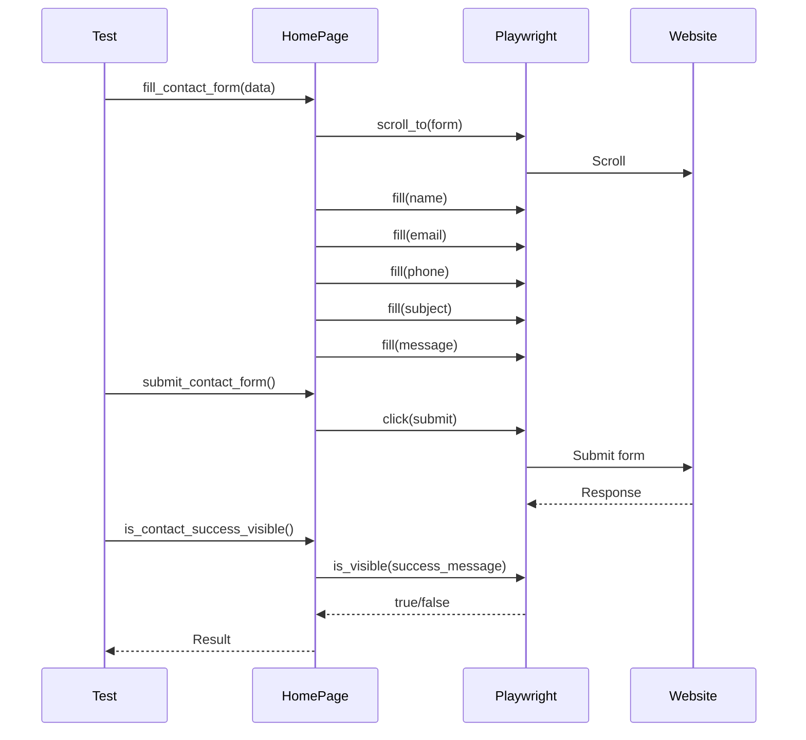

## Admin Login Flow

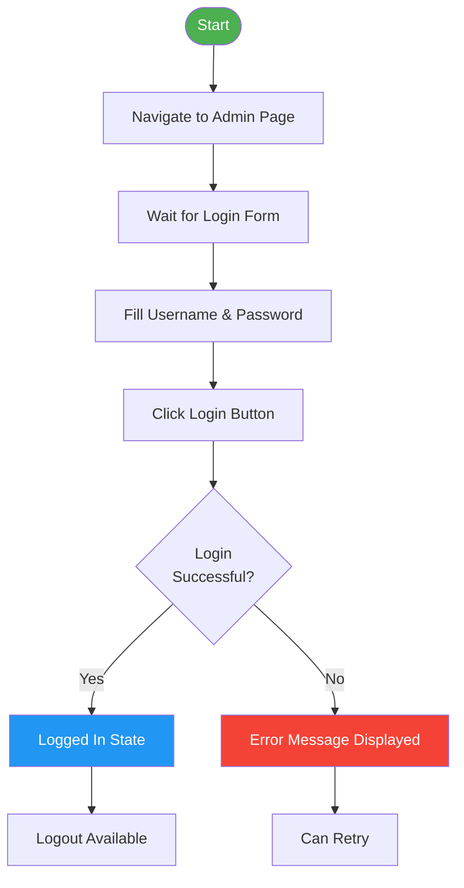

## Booking Calendar Interaction

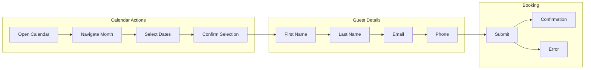

## Locator Strategy

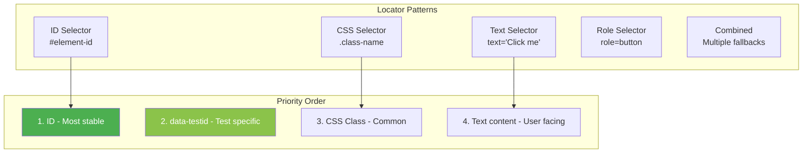

## Assertions Flow

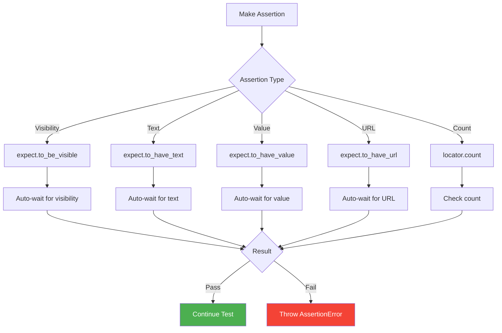
